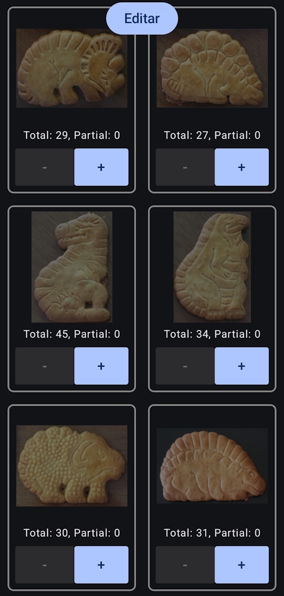

# Dino Counter
    
Aplicació Android escrita en Kotlin + Jetpack Compose, amb l'entorn d'Android Studio, i utilitzada per calcular estadístiques pel llibre "7 Dies Sense Llum". Et permet guardar quantitats i l'ordre amb el que apareixen les galetes Dinosaurus (pensada pels packs de 4 galetes per bosseta).

L'idea és prémer el botó "+" per incrementar el comptador parcial, on la suma d'aquest comptador no pot passar de 4. Quan s'arriba a 4, es deshabiliten els botons "+" i es pot prémer el botó de "Guardar"

<table align="center">
    <tr>
        <td></td>
        <td width="100"></td>
        <td></td>
    </tr>
</table>

Les dades es guarden en format JSON. Per extreure-les s'ha de prémer el botó "Editar", on es pot seleccionar i copiar el text del JSON resultant. En cas d'equivocació i haver guardat malament alguna galeta, també es pot editar directament el JSON:

  

